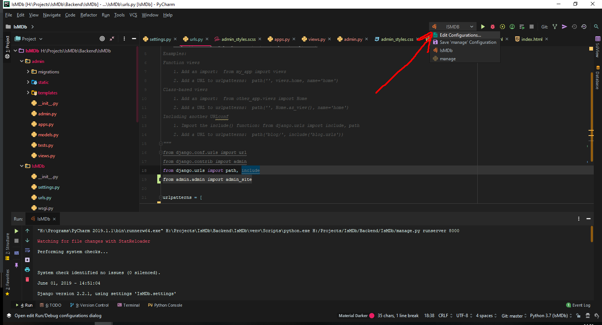

# IsMDb
Main Project's GIT Repository

<h2>Setup Steps:</h2>

- Accept the Invitation sent by mail
- In Pycharm, use VCS to get the Project from this repository
- Checkout as your branche
- Create new Interpreter
- to install the required packages, use this command in the terminal (bottom toolbar)

```
pip install --upgrade -r requirements.txt
```

*Make Sure Before Commiting to uncheck the venv, .idea folders

<h2>Problems:</h2>

<h3>No Run Configurations Problem:</h3>

instead of Edit Configurations, click on add



<h2>TODO:</h2>

- [ ] Front End:
  - [ ] Redesign Home Page
  - [ ] Redesign Review Page
  - [ ] ...
- [ ] Backend:
  - [ ] Admin:
    - [ ] Admin Panel
    - [ ] ...
  - [ ] Users:
    - [ ] Registration Implementation
    - [ ] Login Implementation
    - [ ] User Managment
    - [ ] ...
  - [ ] Reviews:
    - [ ] Fix Models
    - [ ] Views
    - [ ] Routing
    - [ ] Last Retouches
    - [ ] Implementation (w/ Front End)
    - [ ] Add Bookmarks
    - [ ] Add Review Later
    - [ ] Add Likes
  - [ ] Comments:
    - [ ] Conception
    - [ ] Models
    - [ ] Views
    - [ ] Implementations
  - [ ] Suggestions:
    - [ ] Conception
    - [ ] Models
    - [ ] Views
    - [ ] Spell Checking
    - [ ] Implementations
  - [ ] Reports:
    - [ ] Conception
    - [ ] Models
    - [ ] Views
    - [ ] Implementations
  - [ ] Notifications:
    - [ ] Conception
    - [ ] Models
    - [ ] Views
    - [ ] Implementations
- [ ] Additional Features:
  - [ ] Recommendation Engine:
    - [ ] Recommendation Engine Development
    - [ ] Deployment
    - [ ] Datasets
    - [ ] ...
- [ ] Report:
  - ...
