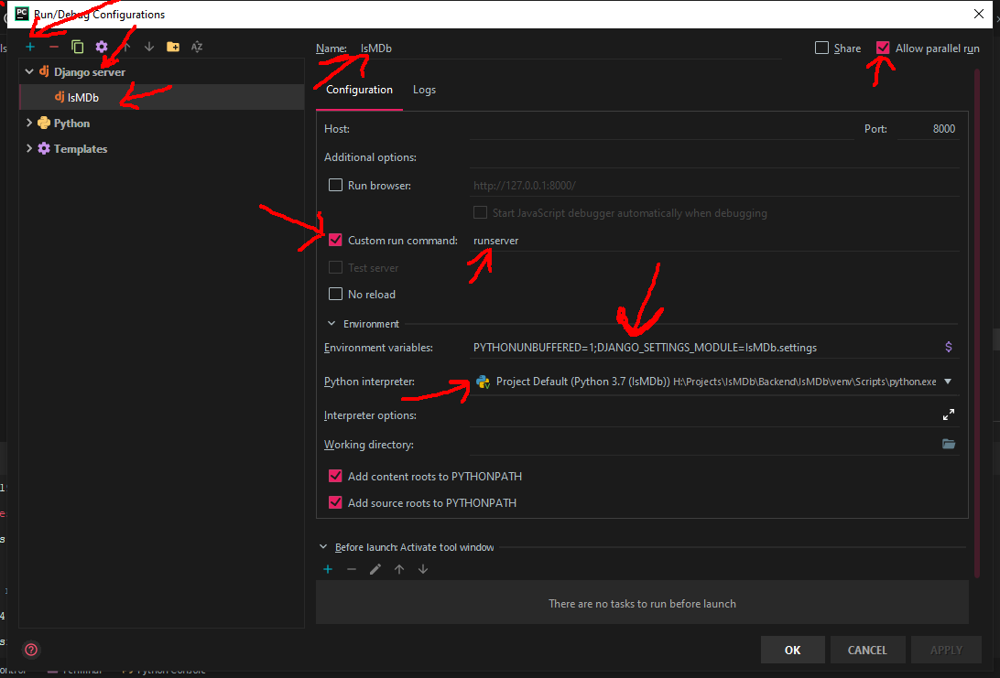

# IsMDb
Main Project's GIT Repository

<h2>Setup Steps:</h2>

- Accept the Invitation sent by mail
- In Pycharm, use VCS to get the Project from this repository
- Checkout as your branche
- Create new Interpreter
- to install the required packages, use this command in the terminal (bottom toolbar)

```
pip install --upgrade -r requirements.txt
```

*Make Sure Before Commiting to uncheck the venv, .idea folders

<h2>Problems:</h2>

<h3>No Run Configurations Problem:</h3>

instead of Edit Configurations, click on add



<h2>TODO:</h2>

- [ ] Front End:
  - [ ] Redesign Home Page
  - [ ] Redesign Review Page
  - [ ] ...
- [ ] Backend:
  - [ ] Admin:
    - [ ] Admin Panel (Frontend : 40%)
    - [ ] Functionalities :
      - [x] Manage Users
      - [x] Manage Groups (eg : Moderator Group)
      - [x] Manage Reviews
      - [x] Manage Suggestions
      - [x] Admin Account
      - [x] Admin History
      - [x] History for each model
      - [ ] Global history (ie : history that tracks all admins and moderators)
  - [ ] Users:
    - [ ] Registration Implementation
    - [ ] Login Implementation
    - [ ] User Profile
    - [ ] User honor points
    - [ ] User Badge ( moderator and admin badges)
    - [ ] User Authentification (Condition)
  - [ ] Reviews:
    - [x] Fix Models
    - [x] Views
    - [x] Routing
    - [ ] Implementation (w/ Front End)
    - [x] Add WatchList
    - [x] Add Likes
  - [ ] Comments:
    - [x] Conception
    - [x] Models
    - [ ] Views:
      - [x] Add Comment
        + [ ] Add Criterias
      - [x] Like Comment
      - [x] Dislike Comment
      - [ ] Fix Redirect
    - [ ] Implementations
  - [ ] Suggestions:
    - [x] Conception
    - [x] Models
    - [x] Views:
      - [x] Adding Suggestion
      - [x] Upvoting Suggestion
    - [x] Admin Approval:
      - [x] Filter Suggestions
      - [x] Approve Suggestions
    - [ ] Implementations
  - [ ] Reports:
    - [ ] Conception
    - [ ] Models
    - [ ] Views
    - [ ] Implementations
  - [ ] Notifications:
    - [x] Conception
    - [x] Send Notification
    - [x] Get Notification
      + [ ] Customize Notifications
      - [ ] Live Update
    - [ ] Implementations
- [ ] Additional Features:
  - [ ] Recommendation Engine:
    - [x] Export Dataframes From Database
    - [ ] Recommendation Engine Development
    - [x] Related Movies 
    - [ ] Deployment
    - [ ] ...
- [ ] Provide Content Locally (Remove all the cdn and download the stuff in the project main static folder): 
    - [ ] Jquery.js
    - [x] bootstrap
    - [ ] fonts
    - [ ] icons
    - [ ] images 
    - [ ] popper.js
    - [ ] ...
- [ ] Deployment:
  - [ ] Docker Implementation:
    - [x] Setup Docker
    - [x] Dockerfile
    - [ ] Upload to Registery
  - [ ] Add Reviews (0/30) *30: starting point, maybe 50 later
- [ ] Report:
  - ...
